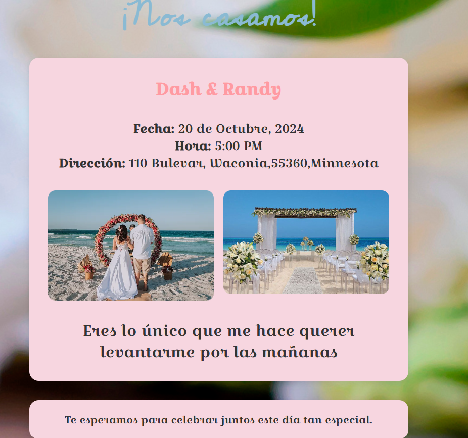
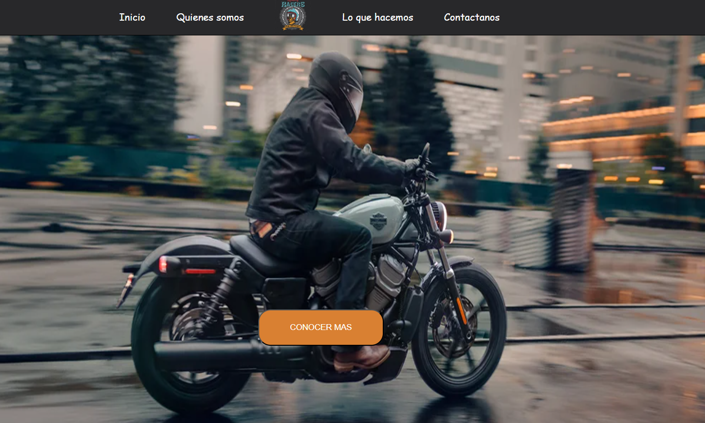
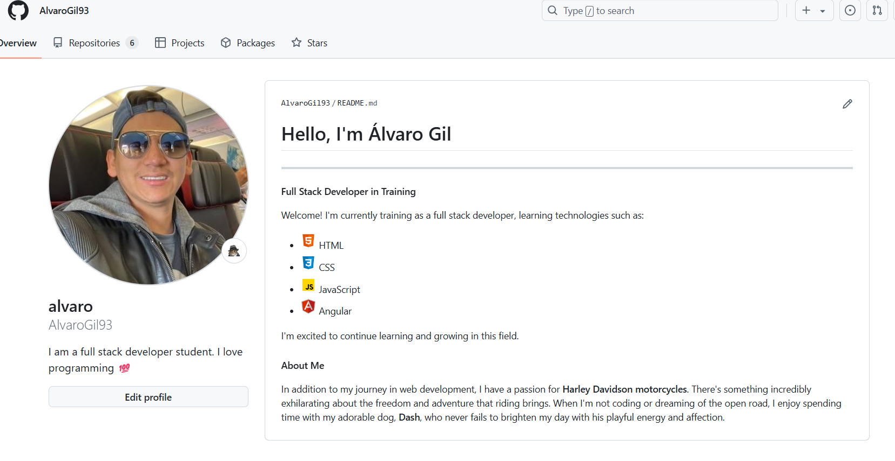

# Álvaro Gil - Developer Portfolio 🚀

¡Bienvenido a mi portafolio! Aquí encontrarás algunos de los proyectos en los que he estado trabajando, usando diferentes tecnologías que amo y siempre estoy aprendiendo. Mi enfoque principal es el desarrollo full stack, y en este portafolio destaco algunos de mis trabajos más recientes.

## Tecnologías Utilizadas 🛠️

- 
- 
- 


## Proyectos Destacados 📁

### 1. [Invitación de Boda](https://github.com/AlvaroGil93/tarjeta-invitacion) 💌
**Descripción**: Proyecto de creación de una tarjeta de invitación de boda usando HTML5 y CSS3. Este proyecto busca simular un escenario real de diseño visual atractivo y funcional.



---

### 2. [Landing Page Harley Davidson](https://alvarogil93.github.io/landingPage/) 🏍️
**Descripción**: Página de aterrizaje centrada en la famosa marca de motocicletas Harley Davidson, diseñada para mostrar los modelos más icónicos. El proyecto se centró en consolidar conceptos básicos de HTML5 y CSS3.



---

### 3. [Mi GitHub](https://github.com/AlvaroGil93) 🔗
**Descripción**: Visita mi perfil de GitHub donde encontrarás todos mis proyectos y contribuciones. ¡Echa un vistazo!



---

### 4. Proyecto en Construcción 🚧
**Descripción**: ¡Un nuevo proyecto emocionante está en camino! Mantente atento.


## Redes Sociales 📱

- [](https://www.linkedin.com/in/AlvaroGil93)
- [](https://www.instagram.com/AlvaroGil93)
- [](https://www.twitter.com/AlvaroGil93)
- [](https://github.com/AlvaroGil93)

## Instalación y Uso ⚙️

Para clonar y ejecutar este portafolio en tu máquina local, sigue los siguientes pasos:

1. Clona este repositorio:

    ```bash
    git clone https://github.com/AlvaroGil93/portfolio.git
    ```

2. Navega al directorio del proyecto:

    ```bash
    cd portfolio
    ```

3. Abre el archivo `index.html` en tu navegador para ver el portafolio en acción.

## Licencia 📝

Este proyecto está bajo la Licencia MIT - consulta el archivo [LICENSE](LICENSE) para más detalles.

---

¡Visita mi [ webpage del Portfolio](https://alvarogil93.github.io/portfolio/#contact)! Si te gusta lo que ves o si tienes alguna idea de colaboración, no dudes en contactarme.🚀
